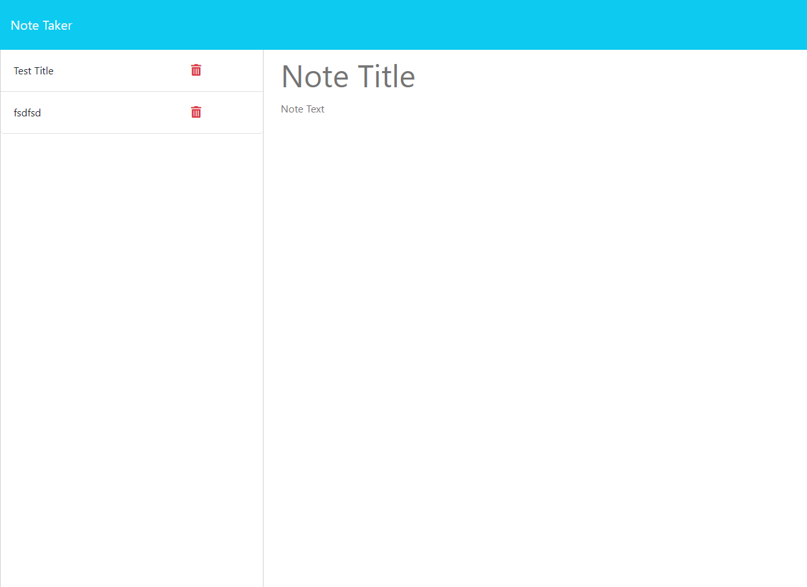

# express-notes-taker
The code uses express to be able to use route to make sure that the clients responses get recorded to db.json. When inputting new data on the website it will be recorded. Whatever is on the .json file it will be saved to the site and displayed nicely. 

github: https://github.com/willieyeh1/express-notes-taker

Deployment: https://express-notes-taker.onrender.com/